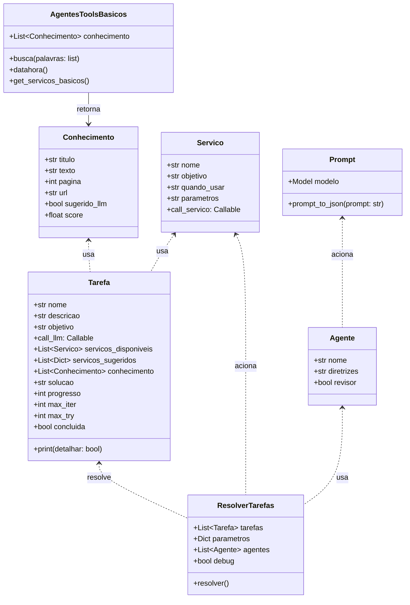

# Diagramas

```mermaid
classDiagram

class Conhecimento {
  +str titulo
  +str texto
  +int pagina
  +str url
  +bool sugerido_llm
  +float score
}

class Servico {
  +str nome
  +str objetivo
  +str quando_usar
  +str parametros
  +call_servico: Callable
}

class Tarefa {
  +str nome
  +str descricao
  +str objetivo
  +call_llm: Callable
  +List~Servico~ servicos_disponiveis
  +List~Dict~ servicos_sugeridos
  +List~Conhecimento~ conhecimento
  +str solucao
  +int progresso
  +int max_iter
  +int max_try
  +bool concluida
  +print(detalhar: bool)
}

class Agente {
  +str nome
  +str diretrizes
  +bool revisor
}

class ResolverTarefas {
  +List~Tarefa~ tarefas
  +Dict parametros
  +List~Agente~ agentes
  +bool debug
  +resolver()
}

class Prompt{
  +Model modelo
  +prompt_to_json(prompt: str)
}

class AgentesToolsBasicos {
  +List~Conhecimento~ conhecimento
  +busca(palavras: list)
  +datahora()
  +get_servicos_basicos()
}

Conhecimento <.. Tarefa : usa
Servico <.. Tarefa : usa
Servico <.. ResolverTarefas : aciona
Tarefa <.. ResolverTarefas : resolve
Agente <.. ResolverTarefas : usa
Prompt <.. Agente : aciona
AgentesToolsBasicos --> Conhecimento : retorna

```
