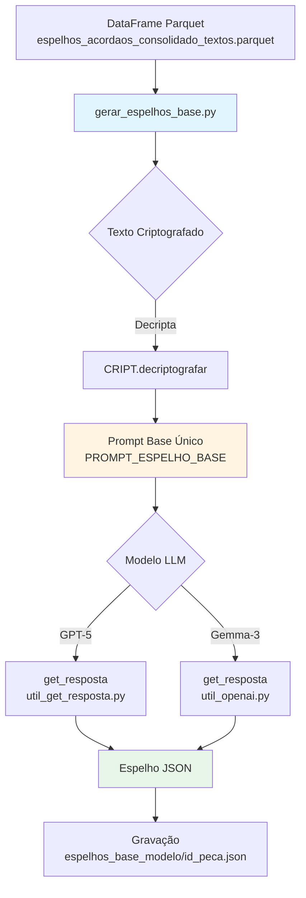
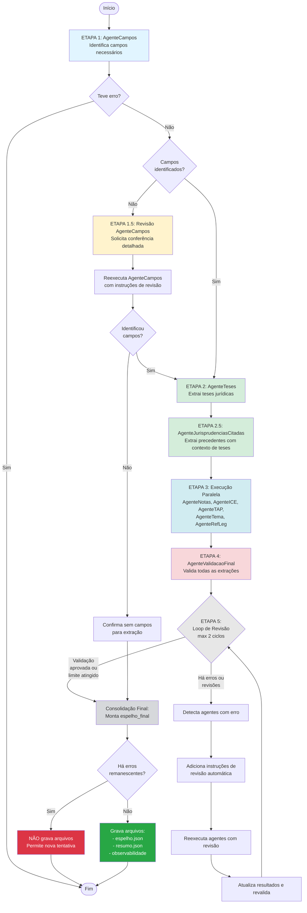
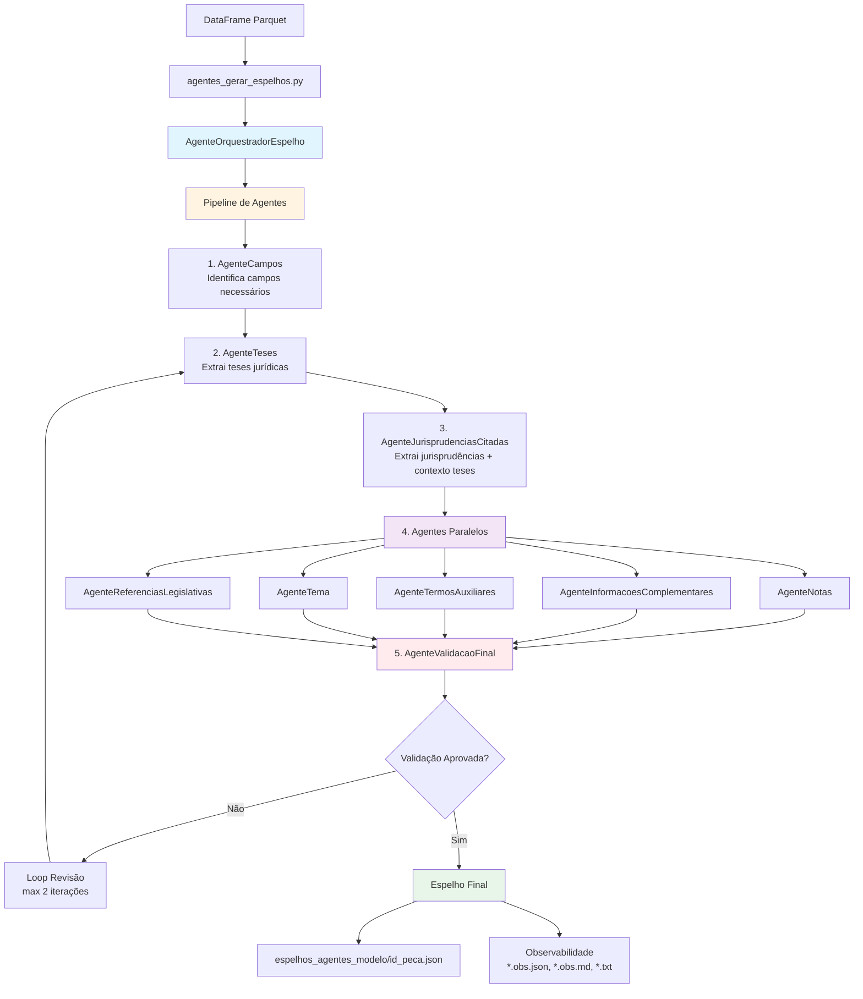
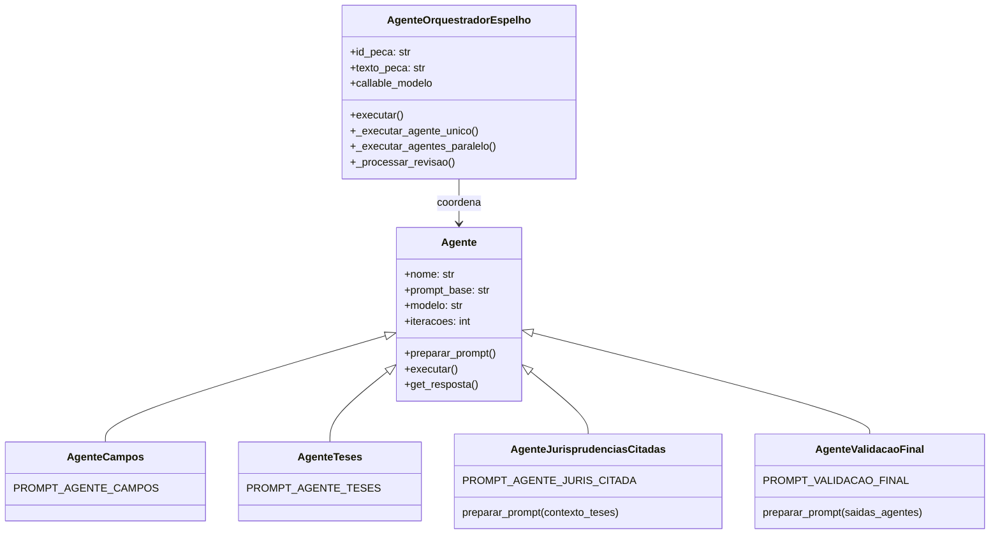
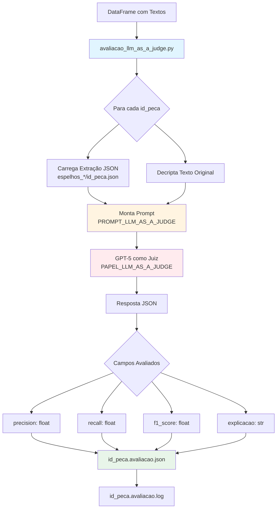
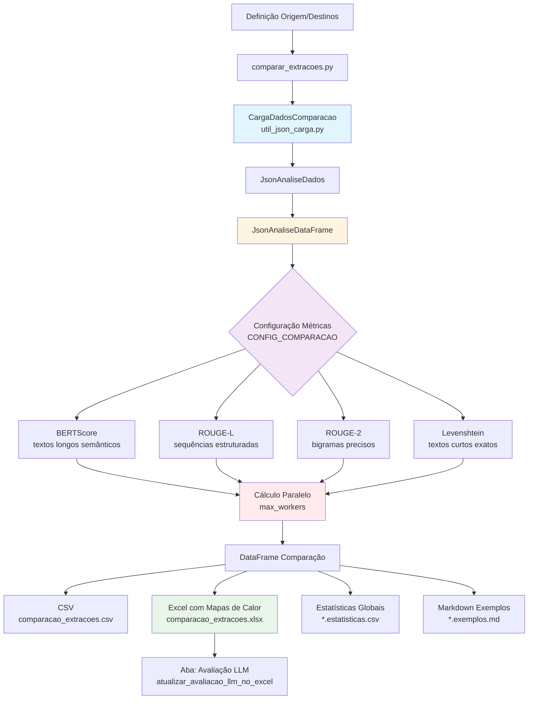
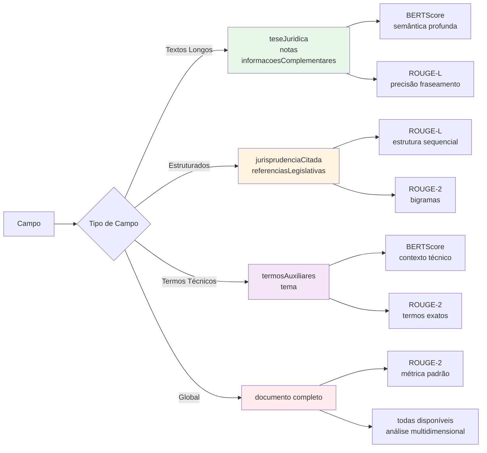
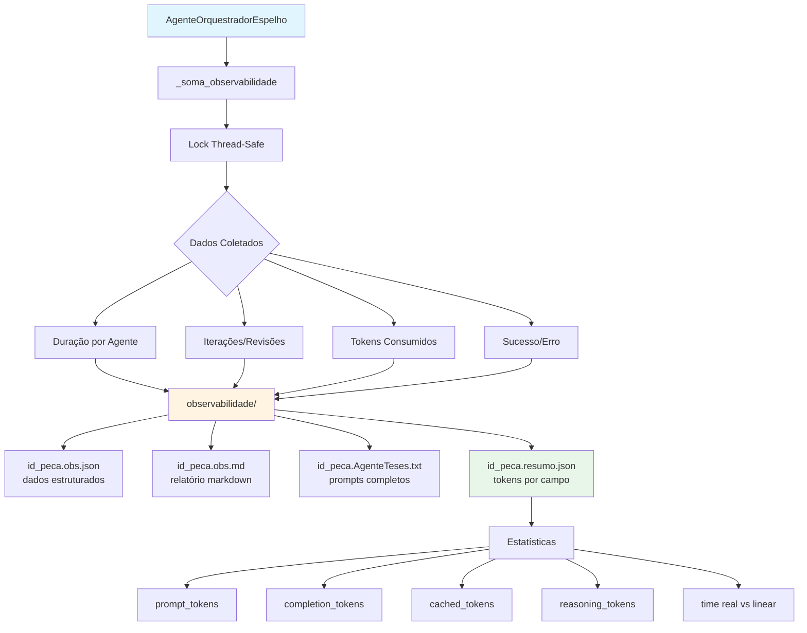
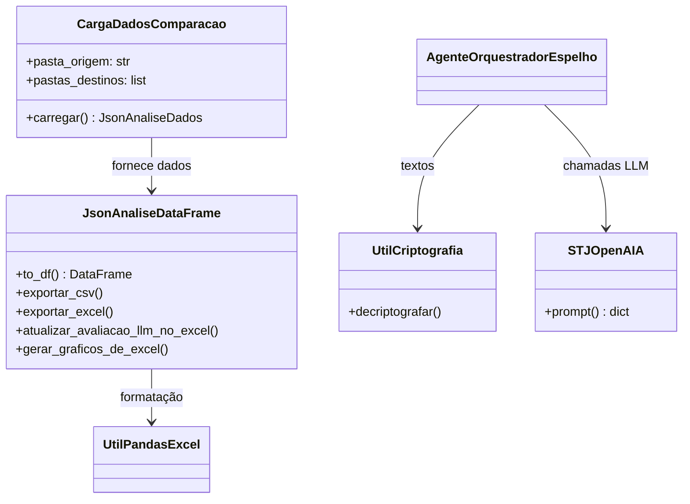

# Diagramas de Fluxo - Experimento de Extração de Espelhos

**[← Voltar para README principal](README.md)**

## Índice de Diagramas

1. [Geração de Espelho Base (Prompt Único)](#1-geração-de-espelho-base-prompt-único)
2. [Fluxo de Orquestração Completo (Sistema de Agentes)](#2-fluxo-de-orquestração-completo-sistema-de-agentes)
3. [Geração de Espelho com Agentes Especializados (Visão Simplificada)](#3-geração-de-espelho-com-agentes-especializados-visão-simplificada)
4. [Estrutura de Agentes](#4-estrutura-de-agentes-agentes_orquestradorpy)
5. [Avaliação LLM-as-a-Judge](#5-avaliação-llm-as-a-judge)
6. [Comparação de Extrações (Métricas de Similaridade)](#6-comparação-de-extrações-métricas-de-similaridade)
7. [Fluxo de Métricas por Campo](#7-fluxo-de-métricas-por-campo)
8. [Observabilidade do Sistema de Agentes](#8-observabilidade-do-sistema-de-agentes)
9. [Principais Classes Utilitárias](#9-principais-classes-utilitárias)

---

## 1. Geração de Espelho Base (Prompt Único)

## 2. Fluxo de Orquestração Completo (Sistema de Agentes)

### Diagrama Detalhado com Todas as Etapas

**Pipeline de Execução Detalhado:**

1. **ETAPA 1**: `AgenteCampos` - Identifica quais campos existem no acórdão
2. **ETAPA 1.5**: Revisão do `AgenteCampos` - Se não identificou campos, solicita revisão com instrução específica para conferir atentamente
3. **ETAPA 2**: `AgenteTeses` - Extrai as teses jurídicas (dependência primária)
4. **ETAPA 2.5**: `AgenteJurisprudenciasCitadas` - Extrai precedentes baseados nas teses extraídas
5. **ETAPA 3**: Execução Paralela - `AgenteNotas`, `AgenteInformacoesComplementares`, `AgenteTermosAuxiliares`, `AgenteTema` e `AgenteReferenciasLegislativas` rodam simultaneamente
6. **ETAPA 4**: `AgenteValidacaoFinal` - Consolida e valida todas as extrações
7. **ETAPA 5**: Loop de Revisão - Processa até 2 ciclos de revisões conforme necessário, reexecutando agentes com erros ou que precisam de ajustes
8. **Consolidação Final**: Monta o espelho final com todos os campos extraídos e metadados
9. **Verificação de Erros**: Apenas grava arquivos se não houver erros remanescentes, permitindo novas tentativas em caso de falha

---

## 3. Geração de Espelho com Agentes Especializados (Visão Simplificada)

**Nota:** Este é um diagrama simplificado. [Ver diagrama completo detalhado acima](#2-fluxo-de-orquestração-completo-sistema-de-agentes).

---

## 4. Estrutura de Agentes (agentes_orquestrador.py)

---

## 5. Avaliação LLM-as-a-Judge

---

## 6. Comparação de Extrações (Métricas de Similaridade)

---

## 7. Fluxo de Métricas por Campo

---

## 8. Observabilidade do Sistema de Agentes

---

## 9. Principais Classes Utilitárias

## Legenda de Cores

- 🔵 **Azul Claro**: Entrada de dados / Carregamento
- 🟡 **Amarelo**: Processamento / Transformação
- 🟣 **Roxo**: Execução Paralela / Múltiplos Agentes
- 🔴 **Vermelho**: Validação / Decisão Crítica
- 🟢 **Verde**: Saída de Dados / Resultado Final

## Arquivos Python Principais

| Arquivo | Função Principal |
|---------|-----------------|
| `gerar_espelhos_base.py` | Extração com prompt único (baseline) |
| `agentes_gerar_espelhos.py` | Extração com sistema de agentes |
| `agentes_orquestrador.py` | Orquestração e coordenação de agentes |
| `prompt_espelho_agentes.py` | Definição de todos os prompts |
| `avaliacao_llm_as_a_judge.py` | Avaliação com GPT-5 como juiz |
| `comparar_extracoes.py` | Comparação com múltiplas métricas |
| `util_json_carga.py` | Carregamento de dados para comparação |
| `util_json.py` | Análise e exportação de resultados |
| `util_bertscore.py` | Configuração e cálculo de BERTScore |
